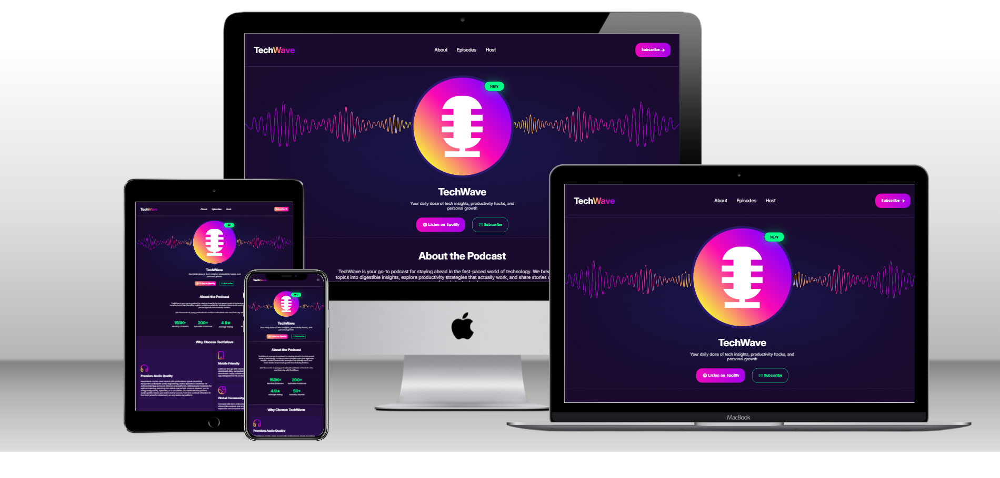

# 🌊 TechWave


A **modern, clean, and fully responsive podcast landing page** built using **HTML5 and Vanilla CSS (CSS3)**.

TechWave is designed to demonstrate how powerful **pure HTML and CSS** can be when building a professional UI without relying on frameworks or external libraries. The project focuses on **responsive layouts, clean UI structure, smooth navigation, and GitHub deployment**.

---

# 📖 Table of Contents

- [🌐 Live Demo](#-live-demo)
- [🖼 Preview](#-preview)
- [📌 Project Overview](#-project-overview)
- [✨ Key Features](#-key-features)
- [🧩 Website Sections](#-website-sections)
- [🎨 Animations & Interactions](#-animations--interactions)
- [🛠 Tech Stack](#-tech-stack)
- [📂 Project Structure](#-project-structure)
- [🚀 Deployment](#-deployment)
- [🎯 What I Learned](#-what-i-learned)
- [📬 Feedback](#-feedback)

---

# 🌐 Live Demo

🔗 **Live Website**

```
https://singhrohan333.github.io/Tech-Wave/
```

---

# 🖼 Preview

<p align="center">
  
</p>

This mockup gives a quick look at the **overall layout, sections, and design style** of the website.

---

# 📌 Project Overview

**TechWave** is a podcast-themed landing page built to showcase modern UI design using only core web technologies.

The primary goals of this project were:

- Build a **fully responsive website**
- Practice **clean HTML structure**
- Create **modern UI layouts using CSS**
- Implement **smooth navigation between sections**
- Deploy the project using **GitHub Pages**

Instead of using frameworks like Bootstrap or Tailwind, everything was built using **custom CSS**.

---

# ✨ Key Features

## 📱 Fully Responsive Layout

The entire website adapts smoothly across multiple devices:

- Desktop
- Laptop
- Tablet
- Mobile devices

Layouts adjust automatically using **Flexbox, responsive units, and media queries**.

---

## 🎯 Smooth Navigation

The navigation bar allows users to smoothly scroll to different sections of the page.

Navigation links include:

- About
- Episodes
- Host

This improves the overall browsing experience and creates a **single-page website feel**.

---

## 🎨 Clean and Modern UI

The design focuses on a modern aesthetic using:

- Gradient buttons
- Card-based layouts
- Clean typography
- Structured spacing
- Smooth hover animations

All UI components were styled manually using CSS.

---

# 🧩 Website Sections

## 🧭 Navigation Bar

### Desktop / Large Screens

- Logo aligned to the **left**
- Menu items centered
- Gradient **call-to-action button** on the right

### Mobile Devices

- Navigation items hidden
- Hamburger menu icon displayed
- Fully responsive navigation layout

---

## 🎙 Banner / Hero Section

The hero section is the first visual highlight of the page.

Features include:

- Full-width **background image**
- Centered **podcast visual circle**
- “New” badge overlay
- Headline and descriptive text
- Two call-to-action buttons

The section remains visually balanced across all device sizes.

---

## 📊 About Section

Introduces the podcast and displays important statistics.

Structure:

- Section heading with description
- **4 statistics cards**

Example statistics may include:

- Number of listeners
- Episodes published
- Average rating
- Industry experts featured

On smaller devices, the cards adapt to a responsive stacked layout.

---

## ⭐ Why Choose TechWave

This section highlights the value and uniqueness of the podcast.

Layout includes **5 feature cards**, each containing:

- Icon
- Feature title
- Description

Responsive behavior:

- Multi-column grid on desktop
- Single-column layout on mobile devices

---

## 🎧 Featured Episodes

Displays selected podcast episodes in card format.

Each card includes:

- Episode title
- Short description
- Duration
- Embedded **YouTube video link**

Layout:

- **3 cards on large screens**
- Responsive stacking for smaller screens

---

## 👨‍💻 Host Section

Introduces the podcast host.

Desktop layout:

- Host image on the **left**
- Name, biography, and social icons on the **right**

Mobile layout:

- Stacked vertical design for readability.

---

## 📌 Footer

The footer includes:

- Brand information
- Platform information
- Copyright notice

Designed with a **centered layout and responsive spacing**.

---

# 🎨 Animations & Interactions

To improve the user experience, subtle animations were implemented:

- Smooth button hover effects
- Soft transitions on UI elements
- Smooth scroll behavior between sections

These animations make the interface feel **dynamic and modern** without overwhelming the user.

---

# 🛠 Tech Stack

This project intentionally avoids frameworks to focus on core technologies.

| Technology         | Purpose              |
| ------------------ | -------------------- |
| **HTML5**          | Website structure    |
| **CSS3**           | Styling and layout   |
| **Flexbox**        | Responsive alignment |
| **CSS Grid**       | Layout structure     |
| **CSS Animations** | UI interactions      |
| **GitHub Pages**   | Website deployment   |

---

# 📂 Project Structure

```
TechWave
│
├── assets
├── styles
│   └── style.css
├── index.html
├── mockup.png
└── README.md
```

---

# 🚀 Deployment

The website is deployed using **GitHub Pages**.

Steps followed:

1. Upload the project to GitHub
2. Open **Repository Settings**
3. Navigate to **Pages**
4. Select the branch (`main`)
5. Deploy from the **root folder**

GitHub automatically generates the live website.

---

# 🎯 What I Learned

This project helped strengthen my understanding of:

- Writing **semantic HTML**
- Creating **responsive layouts**
- Designing **modern UI with CSS**
- Structuring a **real-world landing page**
- Deploying projects using **GitHub Pages**

---

# 🤝 Contributing

Contributions are welcome.

Steps:

1️⃣ Fork the repository  
2️⃣ Create a branch  
3️⃣ Make improvements  
4️⃣ Submit a Pull Request

---

# 📊 GitHub Activity

<p align="center">


</p>

---

# 📜 License

[MIT License](LICENSE)

---

# 👨‍💻 Author & Contact

**Author:**  
Rohan Singh

If you'd like to connect, collaborate, or provide feedback, feel free to reach out:

- 💼 **LinkedIn:** https://www.linkedin.com/in/singhrohan333/
- 💻 **GitHub:** https://github.com/SinghRohan333
- 📧 **Email:** rohan.singh.syl@gmail.com

I'm always open to discussions, suggestions, and learning opportunities in web development.

---

# 📬 Feedback

If you have suggestions, ideas, or improvements, feel free to open an issue or share feedback.

Contributions and discussions are always welcome.

---

⭐ If you like this project, consider **starring the repository** on GitHub!
